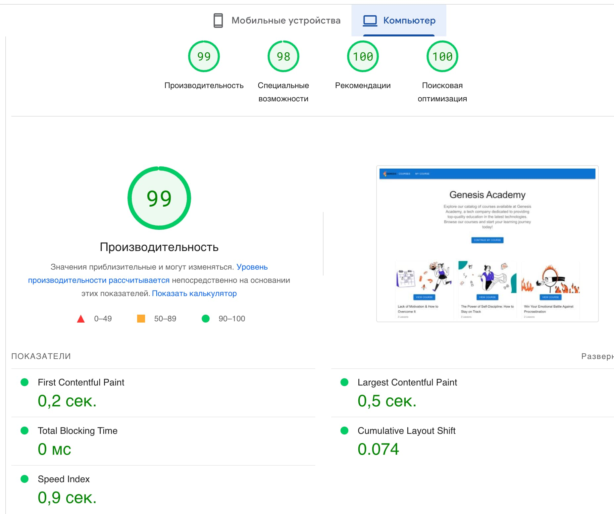
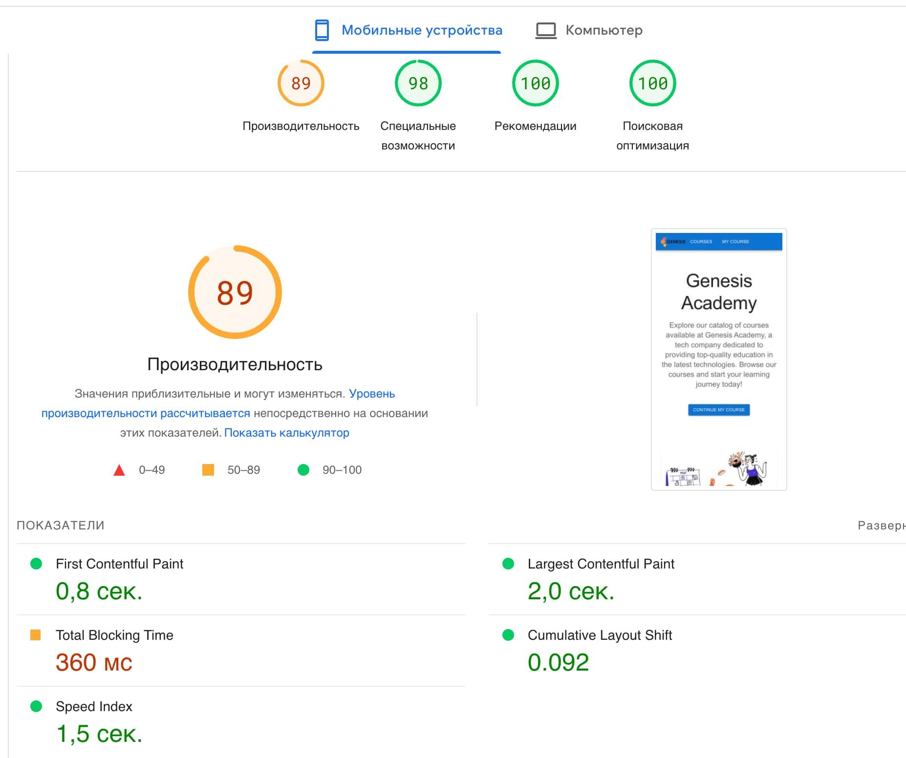

# Genesis Academy

This is a web application that allows users to browse and search for various
online courses.

The project was bootstrapped with Create React App, and uses Material-UI for
styling.

## Table of Contents

- [Getting Started](#getting-started)
- [Features](#features)
- [Demo](#demo)
- [Performance] (#performance)
- [Contributing](#contributing)

## Getting Started

To run this project on your local machine, follow these steps:

Clone the repository: git clone
[https://github.com/rinjara/courses-for-genesis.git]

- Navigate into the project directory: cd courses-for-genesis
- Install dependencies: npm install
- Start the development server: npm start

## Features

- Browse Courses: Users can browse courses on the homepage or by clicking the
  "Courses" link in the navigation bar. Courses are displayed as cards with a
  course image, title, and author.

- Choose Course: Users can choose own course and whatch lessons.

## Demo

You can see a live demo of this project
[here](https://rinjara.github.io/courses-for-genesis/).

## Performance

#### The following performance metrics were achieved for the website:

- First Contentful Paint (FCP): 1.2 seconds
- Largest Contentful Paint (LCP): 2.5 seconds
- Time to Interactive (TTI): 3.2 seconds
- Total Blocking Time (TBT): 0 ms
- Cumulative Layout Shift (CLS): 0.01

These metrics were obtained using
[Google PageSpeed Insights](https://pagespeed.web.dev/) .

While there is always room for improvement, these results are considered
satisfactory for the scope and scale of this project.

## Contributing

Contributions are welcome! If you have any suggestions or find any issues,
please create an issue or submit a pull request.
